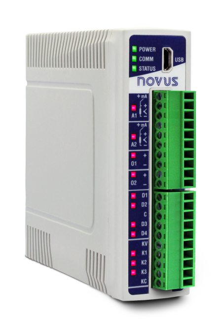
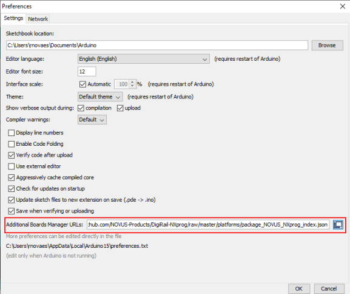

# DigiRail NXprog

## This repository
This repository contains support files to use NOVUS DigiRail NXprog devices such as **NXprog RAMIX 2EA / 2SA / 4ED / 3SD ETH** and **NXprog RAMIX 2EA / 2SA / 4ED / 2RL ETH** with the Arduino IDE.

DigiRail NXprog ia an Arduino-compatible device that allows the use of high level C/C++ programming language, which enables to implement complex algorithms, like recursion logic, state machines, statistical analysis and mathematic equations. Therefore, this is a big advantage  against the complex and old-style of the IEC mid-level programming found in most worldwide PLCs.

The user guide is a short version in English, which only shows the functions that can be used and a summary on how to use DigiRail NXprog.

## Installation

### Driver Installation

#### Windows

1. Download the [signed drivers](https://github.com/NOVUS-Products/DigiRail-NXprog/drivers) and unzip into any folder.
   Note that the Windows 10 generic CDC drivers work as well.
1. Plug in the NXprog.
1. Windows will detect the board. 

#### Linux

1. No driver installation is needed.

### Installing NOVUS NXprog Core support in Arduino IDE 

1. The NOVUS NXprog Core requires Arduino IDE 1.8.6 or above.
1. If not installed, download [Arduino Desktop IDE](https://www.arduino.cc/en/Main/Software)
1. Follow the download and installation guidelines as described in [Install the Arduino Desktop IDE](https://www.arduino.cc/en/Guide/HomePage) 
1. After installation, click File->Preferences in the Arduino IDE. A window will appear like the one shown below:
 
1. Click the button next to Additional Boards Manager URLs.
1. Add the reference to NOVUS platform definition
   > https://raw.githubusercontent.com/NOVUS-Products/DigiRail-NXprog/master/platforms/package_NOVUS_NXprog_index.json
1. Save preferences, then open the Boards Manager.
 
1. Search for 'NXprog' in Boards Manager
 
1. Install the NOVUS package.
1. Close Boards Manager, then click Tools->Board and select your NXproduct under 'NXprog Arduino Boards".
1. Plug in the NXprog.
1. Click Tools->Port and choose the COM port. 
1. You can now upload your own sketch.

## Language reference
The NXprog version Arduino programming language is an extension of standard [Arduino Language](https://www.arduino.cc/reference/en/) can be divided in three main parts: 
* IO Functions
	* [Standard Analog](./AnalogIO.md)
	* [Expert IO](./ExpertAnalogIO.md)
* Values 
	* [Sensor Type](./SensorType.md)
* Structures
	* [Analog Configuration](./AnalogConfiguration.md)
