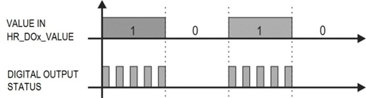
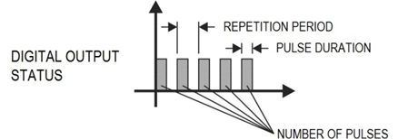
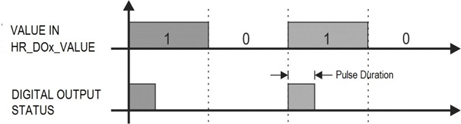

## Digital Input configuration data
The digital inputs are identified as D1 to D8 (see you NXprog model specification) on its front panel. The current configuration of a digital input channel can be read using the functions `NovusConfig.getDInConfig` and 
This function return `din_cfg_t` data structure defined in `novus/nx_config.h` with the following members:

Member | Type | Comment
--- | --- | ---
 enabled | `bool` | channel is enabled/disabled
function | `nx_din_function_t` | Function type
connection | `nx_din_type_t` | Connection type
debounce | `uint16_t` | Time interval to be disregarded by the digital input at each logical state transition. Only used in **Dry Contact** connection type.

For more details, please refer to the NXprog manual.

### Function type
The possible input function types are defined by the values of the `nx_din_function_t` type. 

Mode | nx_din_function_t |Comment
--- | --- | --- 
 Logical Status | `_DIN_LOGICAL_STATE` | Level is converted to the logic states 0 and 1. 
Counter Positive Edge | `_DIN_COUNTER_RISING_EDGE` | Allows the digital input to count the number of pulses received at its terminals. The counter is incremented in the rising edge (transition from 0 to 1) of the received pulse. 
Counter Negative Edge | `_DIN_COUNTER_FALLING_EDGE,` |  The same as above for the falling edge (transition from 1 to 0) of the received pulse. 
Integrator ON/OFF | `_DIN_INTEGRATOR` | Allows the sum (integration) of the time intervals measured with the digital input in logic state 0 to be performed and also the sum of the time intervals measured with the digital input in the logical state 1. It will provide the two pieces of information separately. The value is displayed in seconds. 

For details about connecting sensors, please refer to NXprog Instruction Manual.

### Connection type
These digital channels are suitable for receiving Dry Contact, NPN and PNP electrical signals defined by `nx_din_type_t` type. The allowed values for this member are:
* `_DIN_PNP`
* `_DIN_NPN`
* `_DIN_DRY`

For details about connecting sensors, please refer to NXprog Instruction Manual.

## Digital Output configuration data
These outputs are labeled as K1 to K8 for transistor-sourcing digital output and R1 to R4 for relay-type digital outputs on the NXprog front panel. The current configuration can be read using the functions `NovusConfig.getDOutConfig` and set using the function `NovusExpert.digitalOutput_setMode`.
This function return `dout_cfg_t` data structure defined in `novus/nx_config.h` with the following members:

Member | Type | Comment
--- | --- | ---
 enabled | `bool` | channel is enabled/disabled
mode | `nx_dout_actuation_mode_t` | Actuation mode
pulse_time | `uint16_t` | Pulse duration
pulse_period | `uint16_t` | Repetition period
num_pulses | `uint16_t` | Number of pulses
safe_state | `bool` | Sate state
poweron_state  | `nx_dout_poweron_state_t` | Poweron state

For more details, please refer to NXprog Instruction Manual.

### Actuation mode
The digital output has three actuation modes defined by `nx_dout_actuation_mode_t` type:

Mode | Value | Comment
--- | --- | ---
Logical State | _DOUT_LOGICAL_STATE | The digital output reproduces the logical status of its value set by `digitalWrite` function group.
Pulse | _DOUT_SINGLE_PULSE | When the value set to 1 using `digitalWrite` function, the output will turn on for a specific time interval (set in the **Pulse duration** parameter) and then return to the OFF state. When this output is in ENABLE state does not necessarily imply that the output is ON or activated.
Pulse Train | _DOUT_PULSE_TRAIN | When the value set to 1 using `digitalWrite` function, the output will create a defined number of pulses (set in the **Number of pulses** parameter), with a defined duration (set in the **Pulse duration** parameter) and in a defined period (set in the **Repetition period** parameter). After the pulse sequence, the digital output will return to the off state.

   

   

   
 
These are the valid combination for ***Operating mode***, ***Pulse time*** and ***Pulse period***.

Operating mode | Pulse time | Pulse period | Number of pulses
--- | --- | ---- | ----
`_DOUT_LOGICAL_STATE` | n/u | n/u | must be `0`
`_DOUT_SINGLE_PULSE` | n/u | n/u | must be `1`
`_DOUT_PULSE_TRAIN` | greater or equal to `0` | greater or equal to `0` | must be greater than `1`

In the table above, the value **n/u** indicates that this value is not used in the listed mode.

### Power On State
 The initial state of the device's digital output after initializing the device until a command is acknowledged.
 
 State | Value | Comment
--- | --- | ---
 Off | `_PO_DOUT_OFF` | Allows the digital output to remain off (0) after device initialization.
On | `_PO_DOUT_ON` |Allows the digital output to start on (1) after device initialization.
Last Valid State | `_PO_DOUT_LAST_VALID` | Allows the digital output to adopt the last valid state registered.
